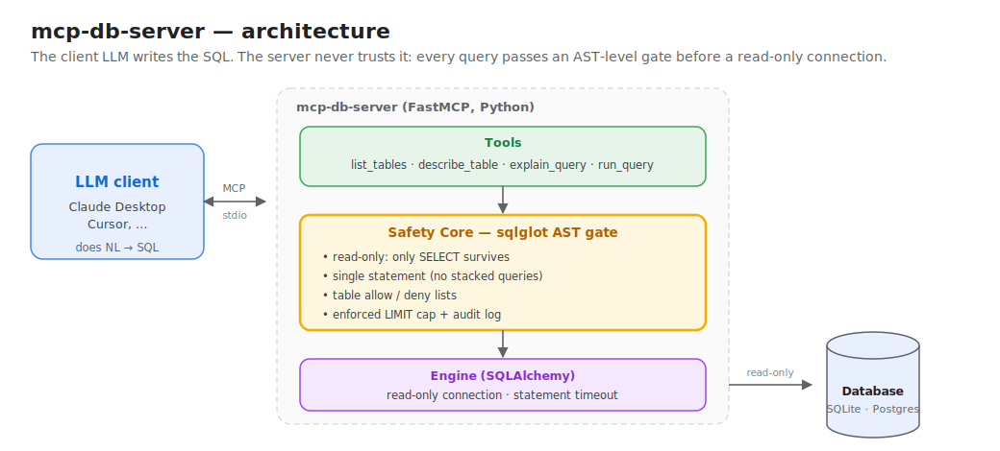

<p align="center">
  
</p>

<p align="center">
  <a href="https://github.com/rudraraval4/mcp-db-server/actions/workflows/ci.yml"></a>
  
  
  
  
</p>

> A production-grade **MCP server** that lets any LLM client (Claude Desktop, Cursor, …)
> query a SQL database in natural language — **read-only, AST-validated, and capped.**

The LLM writes the SQL. This server **never trusts it.** Every query is parsed to an
abstract syntax tree and forced through a safety gate before it is allowed near a
read-only database connection.

<p align="center">
  
</p>

## Why this exists

Letting an LLM run SQL against your database is powerful and terrifying in equal
measure. The hard part isn't generating SQL — clients already do that well. The hard
part is **guaranteeing** the generated SQL can't read what it shouldn't, can't write,
and can't run away with your database. That guarantee is this project.

## Safety guarantees

Every `run_query` call must pass the Safety Core before execution:

- **Read-only** — only `SELECT` / `WITH … SELECT` survive; all DML/DDL is rejected at
  the AST level (not by keyword regex, so comment and casing tricks don't help).
- **Single statement** — stacked queries (`SELECT …; DROP …`) are rejected.
- **Table access control** — allow-list and deny-list enforced against the parsed tables.
- **Row caps** — a `LIMIT` is injected/enforced at `MCP_DB_MAX_ROWS`.
- **Statement timeout** — long queries are aborted.
- **Audit log** — every attempt (allowed or blocked) is logged.

These aren't aspirations — each is pinned by an adversarial test in
[`tests/test_safety.py`](tests/test_safety.py) (casing tricks, comment injection,
stacked statements, `SELECT … INTO`, `PRAGMA`/`ATTACH`, and more). A second,
independent layer is proven in [`tests/test_engine.py`](tests/test_engine.py): even a
write that somehow reached the engine is rejected by the read-only connection.

## Tools

| Tool | Purpose |
|------|---------|
| `list_tables()` | Tables visible under the access policy |
| `describe_table(name)` | Columns, types, keys |
| `explain_query(sql)` | Explains a query (and engine plan) without returning rows |
| `run_query(sql)` | Validated, capped, read-only result set |

## Quickstart

```bash
git clone https://github.com/rudraraval4/mcp-db-server
cd mcp-db-server
pip install -e ".[dev]"
python scripts/seed_db.py     # creates demo.db (e-commerce sample data)
```

## Try it in 30 seconds (no MCP client needed)

The bundled `mcp-db-demo` CLI drives the **exact same service** the MCP server
exposes — so what you see here is what an LLM client gets:

```bash
mcp-db-demo tables
mcp-db-demo describe customers
mcp-db-demo query "SELECT country, COUNT(*) FROM customers GROUP BY country ORDER BY 2 DESC"

# the safety layer in action — every one of these is refused:
mcp-db-demo query "UPDATE products SET price = 0"
mcp-db-demo query "SELECT * FROM customers; DROP TABLE customers"
```

## Use it in Claude Desktop

Add the server to your `claude_desktop_config.json`, then fully restart Claude Desktop.

- **macOS:** `~/Library/Application Support/Claude/claude_desktop_config.json`
- **Windows:** `%APPDATA%\Claude\claude_desktop_config.json`

```json
{
  "mcpServers": {
    "db": {
      "command": "mcp-db-server",
      "env": {
        "MCP_DB_DATABASE_URL": "sqlite:///absolute/path/to/demo.db",
        "MCP_DB_MAX_ROWS": "1000"
      }
    }
  }
}
```

> `command` must resolve to the installed `mcp-db-server` executable. If it isn't on
> Claude Desktop's `PATH`, use the absolute path (e.g. inside your virtualenv:
> `.../.venv/Scripts/mcp-db-server.exe` on Windows, `.../.venv/bin/mcp-db-server` on macOS/Linux).

Then just ask, in plain English:

> *"What tables are in the database?"* · *"Which five customers spent the most?"* ·
> *"Delete the orders table"* → politely refused.

## Configuration

All knobs are environment variables (prefix `MCP_DB_`):

| Variable | Default | Meaning |
|----------|---------|---------|
| `MCP_DB_DATABASE_URL` | `sqlite:///./demo.db` | SQLAlchemy URL (SQLite or Postgres) |
| `MCP_DB_MAX_ROWS` | `1000` | Hard row cap |
| `MCP_DB_STATEMENT_TIMEOUT_SECONDS` | `10` | Abort slow queries |
| `MCP_DB_ALLOWED_TABLES` | _(empty)_ | Allow-list; if set, only these tables |
| `MCP_DB_DENIED_TABLES` | _(empty)_ | Deny-list |
| `MCP_DB_AUDIT_LOG_PATH` | `audit.log` | Audit log location |

## Architecture



The client LLM does the natural-language → SQL reasoning. The server contributes the
thing clients can't safely do themselves: a hard, enforced boundary around what that
SQL is allowed to do. Two independent layers stand between a query and your data — the
**Safety Core** (refuses to *emit* anything but a capped, read-only SELECT) and the
**engine** (refuses to *execute* a write, regardless).

## Project layout

```
src/mcp_db_server/
  config.py      # env-driven settings — every safety knob
  safety.py      # Safety Core: sqlglot AST validation (the heart)
  engine.py      # SQLAlchemy read-only access + introspection
  service.py     # shared logic behind both front-ends
  server.py      # MCP server (FastMCP, stdio)
  cli.py         # mcp-db-demo: same service, no MCP client needed
  formatting.py  # result rendering
  audit.py       # JSONL audit log
scripts/seed_db.py   # reproducible demo database
tests/               # 73 tests, 97% coverage
```

## Development

```bash
pip install -e ".[dev]"
pytest                       # 73 tests
pytest --cov=mcp_db_server   # coverage
```

Optional Postgres support: `pip install -e ".[postgres]"` and point
`MCP_DB_DATABASE_URL` at a `postgresql://…` URL.

## How I built this

A short write-up of the design and the key decision (NL→SQL belongs in the client,
not the server) is in [WRITEUP.md](WRITEUP.md).

## License

MIT — see [LICENSE](LICENSE).
